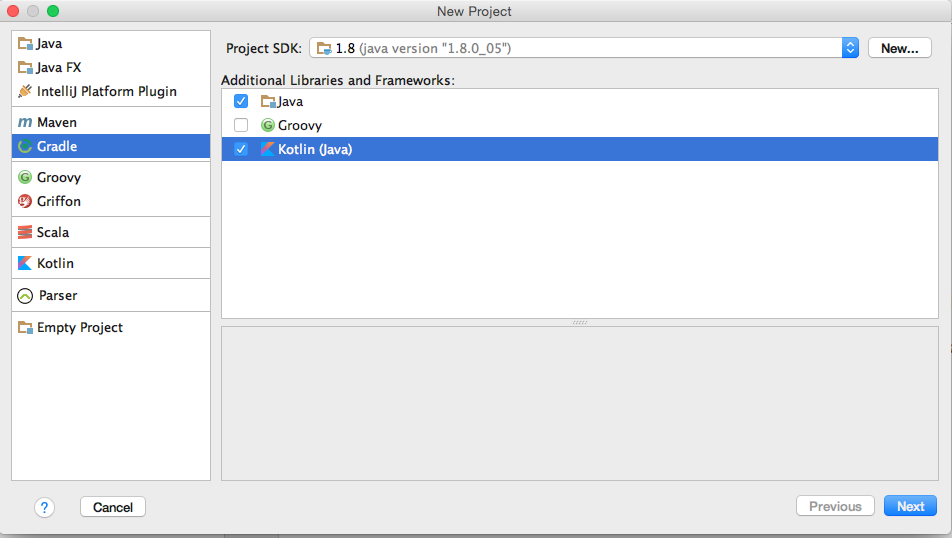

# Create a project

## Requirements

* A recent version of IntelliJ (>= 15.0.4)
* [Gradle](https://gradle.org/)

To install Gradle the easiest way is with brew:

```
brew install gradle
```

## New project



* GroupId: fr.xebia
* ArtifactId: xke-kotlin

* Gradle JVM : 1.8

:warning: In your `build.gradle` (repositories) replace `mavenCentral()` by `jcenter()`

Next: [Spring Boot Configuration](02_ConfigureSpringBoot.md)

:horse:
